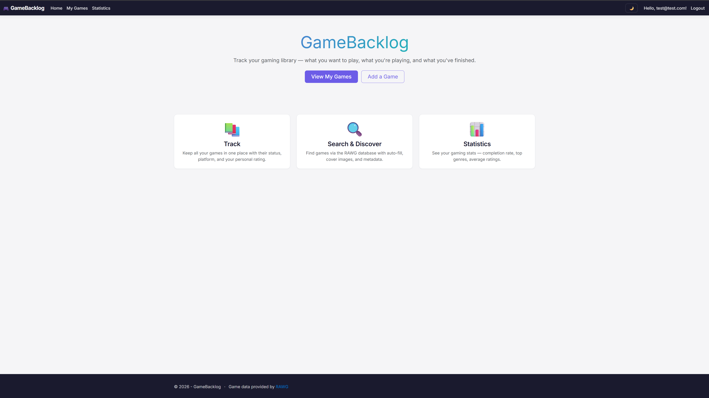
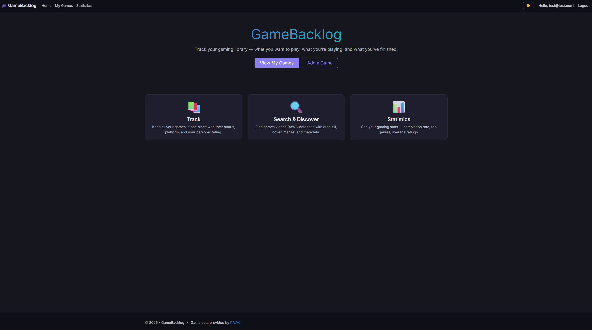
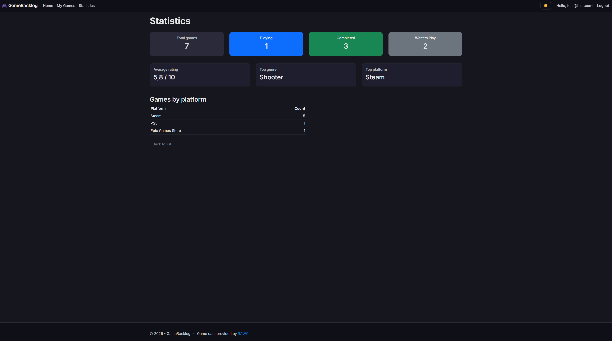
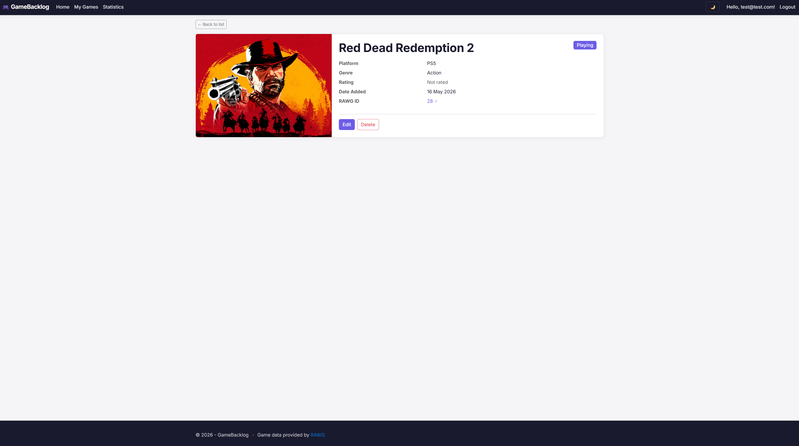
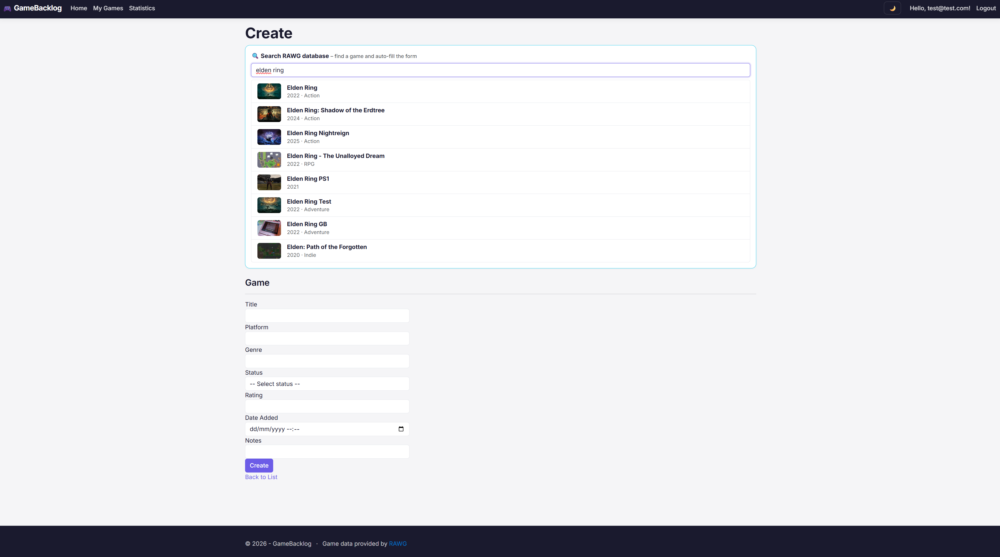

# GameBacklog

A multi-user game library manager built with ASP.NET Core MVC. Track games you want to play, are currently playing, have completed, or dropped — with automatic metadata and cover images from the RAWG video games database.

## Features

- **User authentication** via ASP.NET Core Identity — each user has their own private game collection
- **CRUD operations** for game tracking with status, platform, genre, rating, and notes
- **RAWG API integration** — search 800,000+ games and auto-fill metadata and cover images
- **Search & filter** — case-insensitive search by title and filter by status
- **Statistics dashboard** with LINQ aggregations (total games, average rating, top genre/platform)
- **Dark mode** with localStorage persistence and no flash on page load
- **Responsive design** with custom theming on top of Bootstrap 5

## Tech Stack

- **ASP.NET Core 10 MVC** — web framework
- **Entity Framework Core 10** — ORM with code-first migrations
- **ASP.NET Core Identity** — cookie-based authentication
- **SQLite** — database
- **RAWG API** — external game database integration via HttpClient
- **Bootstrap 5** — UI components with custom theming via CSS variables
- **Vanilla JavaScript** — debounced search, fetch API, theme toggle
- **Inter** typography

## Getting Started

### Prerequisites
- .NET 10 SDK
- A free RAWG API key from [rawg.io/apidocs](https://rawg.io/apidocs)

### Setup
\`\`\`bash
git clone https://github.com/MilanKeltoss/GameBacklog.git
cd GameBacklog
dotnet user-secrets set "Rawg:ApiKey" "YOUR_RAWG_API_KEY"
dotnet ef database update
dotnet run
\`\`\`

Then open `https://localhost:7234` in your browser, register an account, and start adding games.

## Screenshots

### Home page (light / dark)

### Game library with filtering

### Statistics dashboard

### Game details

### RAWG search integration

## Architecture notes

- **Layered structure** — Controllers, Services (RAWG integration), Data (DbContext), Models, ViewModels, Views
- **Dependency injection** throughout — DbContext, UserManager, IRawgService all injected
- **Async/await** for all I/O operations (database and HTTP)
- **DTO pattern** for the RAWG API response mapping, separate from domain models
- **Per-user data isolation** via UserId foreign key with IDOR-safe controller actions
- **Secrets management** via .NET user-secrets (no API keys in source control)

## What I learned building this

This is my first .NET project from scratch. Key takeaways:
- How EF Core migrations work and why code-first beats ad-hoc SQL
- The role of dependency injection in keeping code testable
- How ASP.NET Core Identity integrates with custom DbContext
- Why over-posting protection (`[Bind]`) matters and how cookie auth works under the hood
- Debugging real bugs like form selector conflicts and FOUC

## Author

Milan Keltoš 
https://www.linkedin.com/in/milan-keltoš-7248123a9/

---

Game data provided by [RAWG](https://rawg.io).